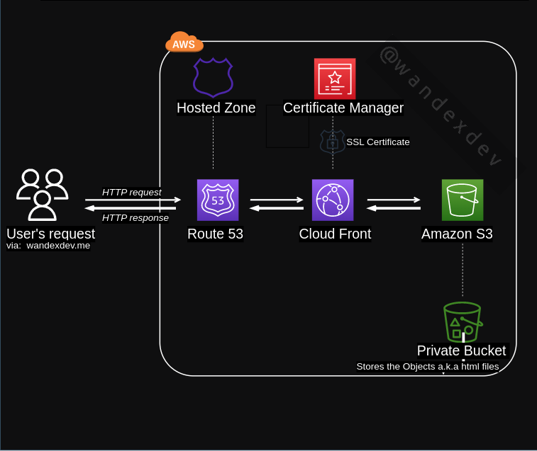

# Hosting a Static WEbsite on a private AWS S3 bucket with CloudFront

# Author:
Raji Risikat Yewande

# Description:
 * Using AWS Cloud provider
 * Using S3 Object Storage
 * Host static sites only
 * Not visible to the general Public
 * Using ClondFront Content Delivery.

# Steps:
Check out the detailed Steps with follow along  screenshots in this [ARTICLE](https://dev.to/wandexdev/how-to-deploy-a-static-website-on-a-private-s3-bucket-served-by-cloudfront-on-a-custom-domain-name-24f5)
